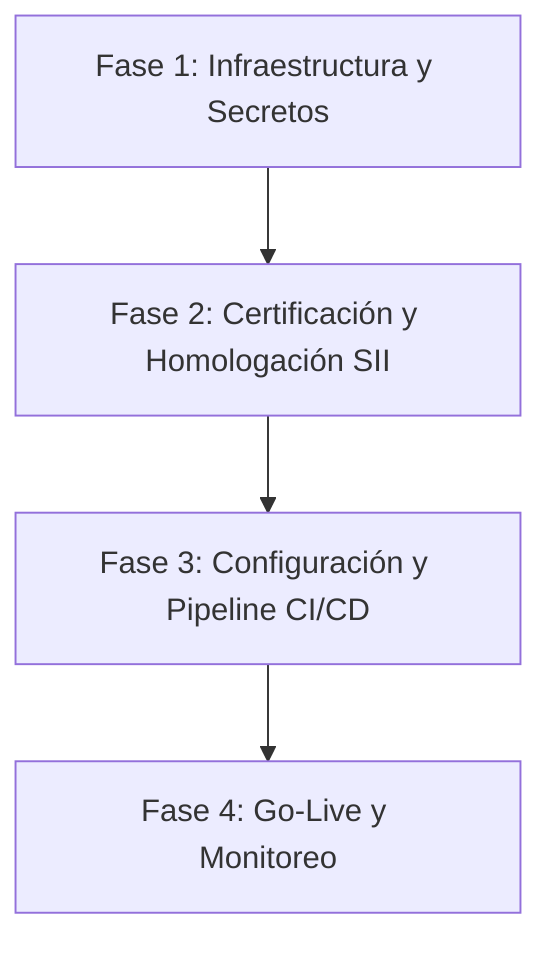

# Reporte de Auditoría General del Sistema: hmEfact

Este documento contiene un análisis detallado del estado actual del sistema **hmEfact**, abarcando la calidad del código, pruebas, base de datos, seguridad, resiliencia y el plan de acción detallado para su despliegue a producción.

---

## 1. Estado de Calidad y Pruebas

Se realizó una auditoría completa del código y la suite de pruebas del frontend y backend, obteniendo los siguientes resultados:

### Frontend (Next.js + TypeScript + Vitest)
* **Verificación de TypeScript:** **100% Exitoso (0 errores).**
  > [!NOTE]
  > Se corrigieron 5 errores de TypeScript en `src/lib/mocks/index.ts` (propiedades faltantes en mocks de `Company`), `integrations-page.tsx` (uso de variante incorrecta en componente `Badge`), y `TaxConfigurationForm.tsx` (incompatibilidad de tipos entre hook-form y Zod coercion).
* **Suite de Pruebas (Vitest):** **5/5 tests aprobados (100% de éxito).**

### Backend (FastAPI + SQLAlchemy + Pytest)
* **Suite de Pruebas (Pytest):** **105/105 tests aprobados (100% de éxito).**
* **Cobertura de Código:** **71.84%** (superando el umbral mínimo exigido del 70% en `pytest.ini`).
* **Linter & Formateador (Ruff):** Se aplicaron correcciones automáticas de ordenación de imports y formato global a los archivos de la aplicación.

> [!IMPORTANT]
> **Bug Crítico Identificado y Corregido:**
> Durante la auditoría del código de workers en `app/workers/tasks/dte_tasks.py` (Línea 164), se identificó un error por variable no definida: la función `retry_failed_dtes_task` utilizaba `select(DTE)` sin haber importado `select` desde `sqlalchemy`.
>
> Esto habría provocado la caída inmediata del worker en producción al intentar reintentar DTEs fallidos o en contingencia. El bug fue corregido agregando el import correspondiente:
> ```python
> from sqlalchemy import or_, select
> ```

---

## 2. Análisis de Arquitectura y Seguridad

### A. Multi-tenancy e Isolation
* **Implementación:** El aislamiento de datos se realiza a nivel lógico en las consultas SQL mediante el filtrado obligatorio por `company_id`.
* **Seguridad API:** Los endpoints públicos del ERP y POS (`/public/v1/*`) requieren el header `X-API-Key` y son controlados por el middleware `APIKeyMiddleware`. Los endpoints internos del dashboard utilizan JWT firmado.

### B. Seguridad de Certificados Digitales (PFX)
* **Encriptación en Reposo:** Los archivos PFX y sus contraseñas se almacenan encriptados en la base de datos utilizando **AES-256-GCM** mediante la librería `cryptography`.
* **Metadatos Desencriptados:** Al subir un certificado, el sistema extrae de forma segura en memoria el `common_name`, `serial_number` y fecha de expiración para mostrarlos en el frontend sin necesidad de desencriptar la llave privada en cada renderizado.

### C. Capa de Resiliencia del SII
* **Circuit Breaker:** Se implementa con estados compartidos en Redis (`CLOSED`, `OPEN`, `HALF_OPEN`).
* **Manejo de Caídas:** Si el SII reporta fallas continuas, el circuito se abre y el sistema entra en **Modo Contingencia**: los DTEs se guardan firmados localmente en estado `"contingency"` y el dashboard del usuario muestra alertas informativas con botones de reintento manual.
* **Recuperación Automática:** Un worker en segundo plano reintenta enviar de forma asíncrona todos los DTEs en contingencia una vez el canal con el SII se restablece.

---

## 3. Limitaciones Actuales y Riesgos para Producción

Antes de lanzar a producción, se deben resolver las siguientes limitaciones técnicas detectadas en la arquitectura:

| Componente | Estado Actual | Riesgo en Producción | Acción Requerida |
|---|---|---|---|
| **Almacenamiento de Archivos** | Solo driver local (`FILE_STORAGE_DRIVER="local"`) | Pérdida de PDFs/XMLs si se despliega en contenedores efímeros (como AWS ECS o Kubernetes) sin volúmenes persistentes. | Implementar driver de **Amazon S3** o **Google Cloud Storage** en `app/services/storage.py`. |
| **Envío de Correos** | Configurado con Mailhog (puerto 1025) | Los correos de notificación a clientes no se enviarán. | Integrar un proveedor de email transaccional real (**SendGrid**, **Amazon SES**, **Mailgun**). |
| **Secretos & JWT** | Valores por defecto (`change-me-in-production`) | Compromiso total de la seguridad de la plataforma y firmas. | Rotación obligatoria de `JWT_SECRET_KEY` y `CERTIFICATE_ENCRYPTION_KEY` usando variables de entorno seguras. |
| **Ambiente SII** | URLs apuntan a Sandbox / SimpleAPI ficticio | No se emitirán DTEs válidos ante el SII. | Cambiar configuración a producción de SimpleAPI o endpoints oficiales del SII y realizar pruebas de homologación. |

---

## 4. Plan de Despliegue a Producción (Paso a Paso)

El despliegue de **hmEfact** a producción consta de 4 fases secuenciales:



### Fase 1: Infraestructura y Base de Datos
1. **Base de Datos:** Configurar PostgreSQL administrado (Amazon RDS o Google Cloud SQL) con backups automáticos y SSL habilitado.
2. **Caché y Mensajería:** Configurar Redis (Amazon ElastiCache o Redis Cloud) para el Circuit Breaker y Celery.
3. **Almacenamiento en la Nube:** Crear un bucket privado en AWS S3 para resguardar los XMLs y PDFs de los DTEs.
4. **Cómputo:** Configurar servicios de contenedores (Docker en VPS robusta, AWS ECS, o Kubernetes) para correr la API de FastAPI, el worker de Celery y el scheduler (Celery Beat).

### Fase 2: Certificación y Homologación SII
Para que las empresas puedan emitir DTEs en producción ante el Servicio de Impuestos Internos (SII) de Chile:
1. **Certificado Digital:** El representante legal debe adquirir un certificado digital de un proveedor autorizado (e.g., Acepta, E-Sign) en formato `.pfx` o `.p12`.
2. **Inscripción en el SII:** Registrar la empresa en el portal del SII en el "Sistema de Facturación Propio o de Mercado".
3. **Set de Pruebas y Simulación:**
   * Emitir un set de documentos de prueba (Facturas, Notas de Crédito, Guías de Despacho) en el ambiente de certificación (`maullin.sii.cl`).
   * Enviar los sobres XML (EnvioDTE) firmados digitalmente.
4. **Obtención de la Resolución:** Tras aprobar las pruebas de formato y envío, el SII emite una Resolución de Facturación Electrónica que autoriza el paso a Producción.
5. **Carga de folios (CAF):** Descargar los archivos de folios (CAF) autorizados por el SII e importarlos al sistema para comenzar la emisión productiva.

### Fase 3: Variables de Entorno (Producción)
Definir obligatoriamente en el servidor las siguientes variables:

```ini
ENVIRONMENT=production
DEBUG=False
POSTGRES_HOST=your-rds-endpoint.amazonaws.com
POSTGRES_DB=hme_fact_prod
POSTGRES_USER=db_admin_user
POSTGRES_PASSWORD=secure-db-password-1234
REDIS_URL=redis://your-elasticache-endpoint:6379/0
JWT_SECRET_KEY=generate-a-cryptographically-secure-key-64bytes
CERTIFICATE_ENCRYPTION_KEY=generate-a-32-byte-encryption-key-for-pfx
CELERY_BROKER_URL=redis://your-elasticache-endpoint:6379/1
CELERY_RESULT_BACKEND=redis://your-elasticache-endpoint:6379/1
FILE_STORAGE_DRIVER=s3
AWS_ACCESS_KEY_ID=your-s3-access-key
AWS_SECRET_ACCESS_KEY=your-s3-secret-key
AWS_STORAGE_BUCKET_NAME=prod-hme-fact-documents
SMTP_HOST=smtp.sendgrid.net
SMTP_PORT=587
SMTP_USER=apikey
SMTP_PASSWORD=your-sendgrid-api-key
SII_PROVIDER=simpleapi
SII_BASE_URL=https://api.sii.cl
SIMPLEAPI_BASE_URL=https://api.simpleapi.cl
SIMPLEAPI_API_KEY=your-simpleapi-production-api-key
```

### Fase 4: Monitoreo y Observabilidad
1. **Logs:** Los logs JSON de hmEfact están listos para ser ingeridos por CloudWatch, ELK Stack, o Datadog.
2. **Dashboard SII:** Utilizar el endpoint `/api/v1/admin/sii/status` para monitorear el estado de salud de la conexión con el SII y la tasa de fallas consecutivas.
3. **Métricas SaaS:** Monitorear el consumo de cuotas de DTEs y llamadas API por parte de los clientes a través del panel de SuperAdmin.
